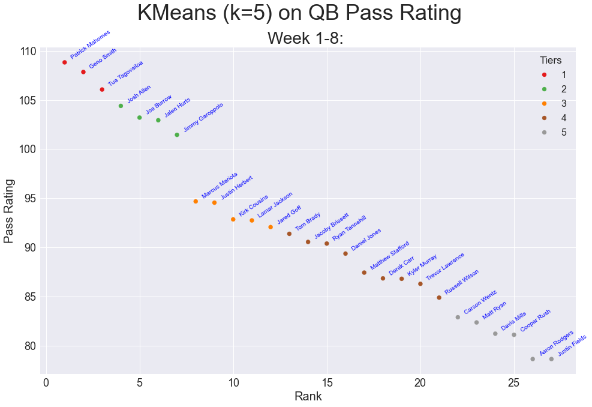

# NFL-wk9-analysis

Visualizations for QB Total Yards, QB Total Touchdowns, and QB Passer Rating from Week 1 through Week 8 of the 2022 NFL season.
Looking into APIs for continuous data integration. K Means clustering performed on data for the visualizations. Only QBs who have played at least 6 games were included in these visualizations, as smaller sample sizes may lead to more unreliable conclusions. 

